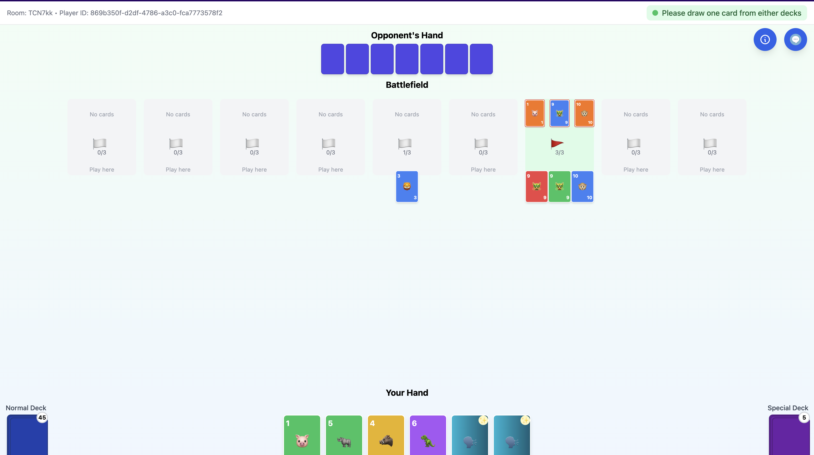
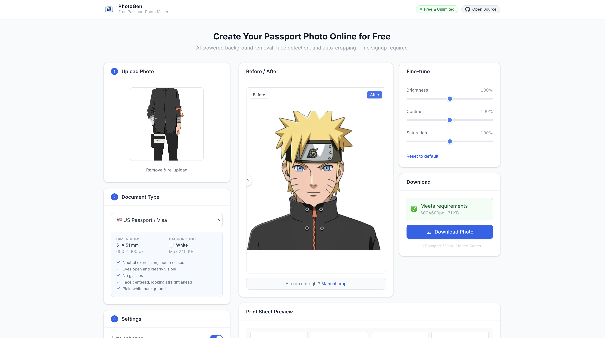

hey, i'm dang 👋

prev:

 Meta - SWE Intern

 ServiceNow - SWE Intern

 Moffitt Cancer Center - Research Trainee

 USF - Teaching Assistant

 USF Bellini College - Student Developer

## projects

<table>
<tr>
<td width="50%" valign="top">

**[battleline](https://github.com/deidaraiorek/battleline)** - real-time 2-player card game

</td>
<td width="50%" valign="top">

**[photogen](https://github.com/deidaraiorek/photogen)** - free passport photo generator

</td>
</tr>
</table>
